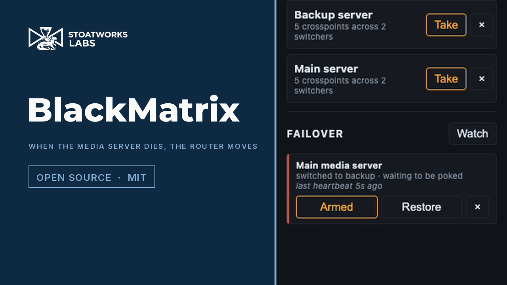

# BlackMatrix

> **AI-assisted project.** This codebase was created with [Claude Code](https://claude.com/claude-code)
> (Anthropic), directed and reviewed by a human author. It was developed against a
> built-in simulated switcher fleet (`--mock`) and a real TCP client speaking the
> Videohub protocol, then **checked against a real ATEM Mini Extreme ISO**, which
> corrected the routing rules rather than confirming them — the availability masks
> were probed on the hardware and this app's matrix was served from it as a 29x39
> router. What has **never** happened is a real Videohub control panel driving it,
> and no real Videohub has ever been one of its devices. Prove it on your own kit
> before it goes anywhere near a show.

A **crosspoint router matrix for a fleet of Blackmagic ATEM switchers** — sources
across the top, destinations down the side, one click to route — that also
**pretends to be a Blackmagic Videohub** so hardware router panels, Companion and
Blackmagic's own software can drive the same crosspoints — and, for a redundant
rig, so a **media server can switch to its backup machine through it**.

[](https://www.youtube.com/watch?v=A0YzfXbPcG0)

*Fifty-three seconds, filmed against a released build and its simulated fleet. The
failover at the end fires because the heartbeat genuinely stopped and the app's own
state machine decided it had — the crosspoints move because a salvo was taken, not
because a video was edited. Two of the switcher's cameras are renamed to stand in for
the media servers; that is the only staging.*

An ATEM has no single "router", so this treats every bus that takes one source at
a time as a destination, grouped into sections:

| Section | Destinations | Routed with |
|---|---|---|
| **Outputs** | Aux 1..n | `setAuxSource` |
| **Program / Preview** | Program and Preview per ME | `changeProgramInput` / `changePreviewInput` |
| **Keyer sources** | USK fill and key per ME, DSK fill and key | `setUpstreamKeyer*Source` / `setDownstreamKey*Source` |
| **SuperSource** | Box 1..n, art fill, art key | `setSuperSourceBoxSettings` / `setSuperSourceProperties` |
| **Multiview** | Every multiviewer window | `setMultiViewerWindowSource` |

Which sources are legal on which destination is **read from the switcher**, not
from a model table: every ATEM input reports a `sourceAvailability` mask (aux,
multiviewer, SuperSource art, SuperSource box, key source) and a `meAvailability`
mask. Illegal cells are drawn hatched and refused server-side — so an aux output
cannot be routed back onto an aux bus, and ME 1's output cannot be routed onto ME 1.

## Quick start

```bash
npm install
npm run dev:mock
```

That serves <http://localhost:8533> with three simulated switchers of deliberately
different shapes (1 M/E, 4 M/E, compact) and a Videohub server per switcher. No
hardware, no network switchers, nothing to break.

Against real switchers, write `blackmatrix.config.json` (see
`config/blackmatrix.config.example.json`) and:

```bash
npm run build && npm start
```

<!-- downloads:start -->

## Download

**[v0.2.2](https://github.com/stoatworks-labs/blackmatrix/releases/tag/v0.2.2)** — prebuilt for macOS, Windows and Linux. Pick your platform:

<details>
<summary><b>macOS</b> — Apple Silicon, Intel</summary>

| Build | Download | Size |
| --- | --- | --- |
| Apple Silicon · .dmg disk image | [`BlackMatrix_0.2.2_aarch64.dmg`](https://github.com/stoatworks-labs/blackmatrix/releases/download/v0.2.2/BlackMatrix_0.2.2_aarch64.dmg) | 51 MB |
| Intel · .dmg disk image | [`BlackMatrix_0.2.2_x64.dmg`](https://github.com/stoatworks-labs/blackmatrix/releases/download/v0.2.2/BlackMatrix_0.2.2_x64.dmg) | 54 MB |
| Apple Silicon · .pkg installer | [`blackmatrix-0.2.2-macos-aarch64.pkg`](https://github.com/stoatworks-labs/blackmatrix/releases/download/v0.2.2/blackmatrix-0.2.2-macos-aarch64.pkg) | 47 MB |
| Intel · .pkg installer | [`blackmatrix-0.2.2-macos-x86_64.pkg`](https://github.com/stoatworks-labs/blackmatrix/releases/download/v0.2.2/blackmatrix-0.2.2-macos-x86_64.pkg) | 49 MB |

</details>

<details>
<summary><b>Windows</b> — x64</summary>

| Build | Download | Size |
| --- | --- | --- |
| x64 · .exe installer | [`BlackMatrix_0.2.2_x64-setup.exe`](https://github.com/stoatworks-labs/blackmatrix/releases/download/v0.2.2/BlackMatrix_0.2.2_x64-setup.exe) | 29 MB |

</details>

<details>
<summary><b>Linux</b> — x64</summary>

| Build | Download | Size |
| --- | --- | --- |
| x64 · .deb package (Debian/Ubuntu) | [`BlackMatrix_0.2.2_amd64.deb`](https://github.com/stoatworks-labs/blackmatrix/releases/download/v0.2.2/BlackMatrix_0.2.2_amd64.deb) | 56 MB |
| x64 · .rpm package (Fedora/RHEL) | [`BlackMatrix-0.2.2-1.x86_64.rpm`](https://github.com/stoatworks-labs/blackmatrix/releases/download/v0.2.2/BlackMatrix-0.2.2-1.x86_64.rpm) | 56 MB |

</details>

All builds, checksums and release notes: [github.com/stoatworks-labs/blackmatrix/releases](https://github.com/stoatworks-labs/blackmatrix/releases).

macOS builds are signed and notarised and open normally. The Windows builds are unsigned, so SmartScreen warns once.

<!-- downloads:end -->

## Videohubs, not just switchers

A real Blackmagic Videohub can be a device in the same fleet:

```jsonc
{ "id": "hub", "name": "Machine room", "type": "videohub", "address": "192.168.1.60" }
```

Its inputs become sources and its outputs become destinations in the same grid,
so one screen covers the switchers and the router between them, and a salvo can
span both. Locks on a Videohub are the router's own and shared with every other
client on it. Details, and the **ties** that make an ATEM bus and a router
output follow each other: **[docs/videohub.md](docs/videohub.md)**.

## Capture a switcher before you lose it

```bash
npm run capture -- 192.168.10.240 --name "Stage"
```

The availability masks this whole project depends on exist only in the protocol
— not in an ATEM autosave, not in any file a switcher leaves behind. A capture
puts the real shape of a real switcher on disk, and `"capture": "<file>"` on a
device replays it with no hardware present. See
**[docs/capture.md](docs/capture.md)**, including the opt-in probe that tests
the masks against the hardware.

## Adding devices

The **Devices** page (top right) is where switchers and routers are added, edited,
reconnected and removed, with no config file and no restart. **Scan network**
sweeps the local /24s for both kinds — a switcher answers on UDP 9910, a router
on TCP 9990, and neither answers the other's probe — and offers what it finds.

Ports for the Videohub emulation are assigned from `basePort` upward and written
back to the config, so they stay put when devices are added or removed. A panel
is configured against a port number; that number is a fact about the device, not
about where it sits in a list.

A device id cannot be changed once made — salvos, ties and label overrides are
all keyed on it. Removing a device leaves salvos and ties that reference it
alone rather than rewriting them, and says which ones: an operator who pulls a
switcher out for an hour should get their salvos back when it returns.

## On a phone

The web UI is responsive: below 800px the grid is replaced by an X-Y panel —
a destination list showing what each is taking, then the sources that
destination will accept. Not a smaller grid, because a grid does not shrink;
this is what a hardware panel does for the same reason. **Preset is the default
at that width**, so a mis-tap stages instead of cutting.

That works in any phone browser pointed at the server. There is also a native
iOS app in `mobile/`, which adds the one thing a browser cannot do — **finding
the server without typing an address**:

```bash
cd mobile
npm install
npm run ios:init      # once, generates the Xcode project
npm run ios:build     # or: npx tauri ios build --debug --target aarch64-sim
```

It is a shell, deliberately: it sweeps the local /24s for BlackMatrix servers,
remembers the ones you use, and then shows the server's own UI. It does not
speak the ATEM or Videohub protocols — a phone has no business holding a
switcher connection open while the OS suspends it, and the panel emulation needs
a listening socket. Both stay on the server.

Android builds too (`npm run android:init`, then `npm run android:build`). It
needs `ANDROID_HOME`, `NDK_HOME` and a `JAVA_HOME` pointing at **JDK 21** —
Gradle cannot use JDK 25, and says so only as a bare `> 25.0.4`.

Neither mobile app has run on a physical device: that needs an iOS development
profile and an Android release key, both of which are credentials rather than
code. **[docs/signing.md](docs/signing.md)** has the steps, and the build wiring
for both is already in place.

## The hosted simulator

```bash
npm run sim          # locally, on :5183
npm run sim:build    # static build in packages/web/dist-sim
```

A build of the same UI that simulates its devices **in the browser tab**, with a
model list covering the ATEM and Videohub ranges. It is a demo and says so on
every screen: nothing is on a network, nothing is being controlled, and no web
page can reach this hardware — the ATEM protocol is UDP, the Videohub protocol
is raw TCP, and the emulation this app offers panels has to *listen* on a port.
A browser can do none of those things.

It is not a reimplementation. The simulator builds a real `AtemState` and runs it
through the same matrix model, the same legality rules and the same grid as the
live app, so what it shows is what the app would show. What it cannot be is
*accurate about a model*: the names are Blackmagic's, and only the entries marked
as read off hardware carry real numbers. Everything else is an approximate shape
for that class of device, and a capture replaces it with the truth.

## Configuration

```jsonc
{
  "port": 8533,                                   // UI + REST
  "videohub": { "enabled": true, "basePort": 9990, "host": "0.0.0.0" },
  "devices": [
    { "id": "stage", "name": "Stage", "address": "192.168.10.240" },
    { "id": "studio", "name": "Studio", "address": "192.168.10.241", "videohubPort": 9995 }
  ],
  "labels": { "stage": { "aux.0": "FOH screens" } },  // your names for destinations
  "salvos": []
}
```

Each switcher gets its own Videohub server: the first on `basePort`, the next on
`basePort + 1`, unless you set `videohubPort`. **If something else on the host
already listens on 9990** — Bitfocus Companion's Videohub panel surface does —
the affected switcher logs the clash, starts without it, and everything else
keeps working. Give it another port.

## Controlling it from a router panel

Point any Videohub client at `<host>:<port for that switcher>`:

- **Bitfocus Companion** — the `blackmagic-videohub` module.
- **A Smart Videohub / Universal Videohub hardware panel**, or Blackmagic's
  Videohub Control software.
- **Anything else** that speaks [the Videohub Ethernet Protocol](docs/videohub.md).

Input numbers are the switcher's sources in ATEM source-id order; output numbers
are the destinations in the section order of the table above. Both orderings are
stable for a given switcher, so a panel's buttons keep meaning the same thing.

Full mapping, what is and is not implemented, and a worked telnet session:
**[docs/videohub.md](docs/videohub.md)**.

## Claims

A destination can be claimed — the flag on its row in the browser, or a lock
from a panel; they are the same thing, and `docs/videohub.md` calls it what the
wire calls it. Claims are held **per IP address**, which is how a real Videohub
does it, so a second panel on the same machine shares one and everyone else is
refused. Shift-click the flag (or send `F` on the wire) to force one open.

It is enforced in one place, so a claim made from a panel refuses a route made
from the browser, and the other way round.

**In the app it is a claim, and a claim stops you too.** The flag on each row
claims that destination: the row crosshatches, its crosspoints stop taking
clicks, it cannot be staged into a take, and the flag is how you release it.
That includes the person who made the claim — on the wire an owner may route
through its own lock, which is the spec and what panels get, but the browser and
the phone app *are* that owner, so a rule that only stopped other clients would
stop nobody who could see the button.

## Salvos

A salvo is a named set of crosspoints **across the whole fleet** — one press sets
them all. Build one in the UI by capturing what destinations are currently taking
(`Build new`, then `+` on each row you want), or write them into the config file.

Every crosspoint in a salvo is attempted; the ones the switcher will not accept
come back named rather than silently dropped. Salvos are this app's own idea —
they are not part of the Videohub Ethernet Protocol — so they exist in the UI and
the REST API only.

## Redundant systems

A redundant media server rig is two machines playing the same show and a router
downstream deciding which one reaches the screens. This can be that router, in
either of the two shapes the industry uses.

**The media server drives it.** disguise's understudy sends matrix routing
itself the moment it takes over a failed machine, and PIXERA fires a control
action at a matrix switcher from its `System Lost` trigger. Both can point at
the Videohub emulation — disguise has a Blackmagic Smart Videohub driver, and
PIXERA can send anything over TCP. Because an ATEM re-syncs its inputs, the main
and backup feeds do not have to be genlocked to each other for a clean cut,
which an SDI router does require.

**Or this app decides.** A **failover watch** polls a machine — a TCP port, a
URL, or a heartbeat it must be sent — and fires a salvo when it stops answering.
It will not fire before it has seen the machine working once, it starts
disarmed, it fires once, and it does not switch back unless you say what "back"
means. What it fires is an ordinary salvo, so the failover can be rehearsed by
pressing Take on it.

**And a plain line protocol** on TCP and UDP (`ascii.enabled`, port 9995) for
anything that can send a string but not speak Videohub — disguise's generic
Telnet Matrix, PIXERA's TCP module, 7thSense, a show controller:

```
ROUTE 2 1          route output 2 to input 1
1*2!               the same thing, Extron style
SALVO backup       fire a salvo by name
3.                 fire the third salvo (Extron preset recall)
FAILOVER main      fire a watch's lost salvo
```

One lock trap is worth knowing before you rely on any of it: a refused route is
answered with `ACK` and an unchanged status, as the Videohub spec requires,
which means **a media server cannot see a refusal**. A locked destination is a
failover that silently does not happen. `videohub.failoverClients` names the
addresses whose routes walk through locks.

All of it, including how to fill in disguise's and PIXERA's fields, is in
**[docs/failover.md](docs/failover.md)**.

## REST API

| Method | Path | Body |
|---|---|---|
| `GET` | `/api/fleet` | — |
| `POST` | `/api/devices/:id/route` | `{ "destination": "aux.0", "source": 3 }` |
| `POST` | `/api/devices/:id/lock` | `{ "destination": "aux.0", "action": "lock\|unlock\|force" }` |
| `POST` | `/api/devices/:id/label` | `{ "destination": "aux.0", "label": "FOH" }` or `{ "source": 3, "label": "Wide" }` |
| `GET` `POST` | `/api/salvos` | a salvo |
| `DELETE` | `/api/salvos/:id` | — |
| `POST` | `/api/salvos/:id/take` | — |
| `GET` `POST` | `/api/failover` | a failover watch |
| `DELETE` | `/api/failover/:id` | — |
| `POST` | `/api/failover/:id/arm` | `{ "armed": true }` |
| `POST` | `/api/failover/:id/trigger` | — take over now |
| `POST` | `/api/failover/:id/restore` | — go back, clear the latch |
| `POST` | `/api/failover/:id/heartbeat` | — for a heartbeat probe |

The browser gets the same state pushed over `ws://<host>:8533/ws`.

Renaming a **source** renames the input on the switcher itself. Renaming a
**destination** is local to this app — the ATEM has no name for "Aux 2".

## Layout

```
packages/
  videohub   @av/videohub      Videohub Ethernet Protocol v2.3, server AND client. Knows nothing about ATEMs.
  ascii      @av/ascii-matrix  The plain-text line protocol. Also knows nothing about ATEMs.
  matrix     @av/atem-matrix   Turns an AtemState into destinations, legal sources, and routing calls.
  server     @blackmatrix/server  Fleet, locks, salvos, failover, REST + websocket, one Videohub per switcher.
  web        @blackmatrix/web     The grid.
```

The three libraries are portable on purpose: `@av/videohub` will put a Videohub
front end on anything with crosspoints, `@av/ascii-matrix` will put a line
protocol on it, and `@av/atem-matrix` has no I/O in it at all.

## Known limits

- **No real Videohub panel has driven it**, and no real Videohub has ever been
  one of its devices — the protocol side is verified against the published
  specification, a TCP client, and an ATEM's own Videohub server, not a panel.
- **No media server has driven the failover support.** It is written from
  disguise's and PIXERA's documentation, and tested against this repo's own
  clients. The numbering is the first thing to check on real kit.
- The first two **multiview windows** are program and preview on most switchers,
  which usually means the switcher ignores a route sent to them. Those rows are
  marked, not hidden.
- **Media player still/clip selection is deliberately not a destination.** It
  takes from the media pool, not from the video sources, so it does not belong in
  a matrix whose columns are sources.
- The failover probes answer "is that machine there", not "is it playing the
  right thing" — a TCP handshake, an HTTP answer, or a heartbeat. Knowing whether
  a media server's output is *correct* means speaking its protocol, which is a
  much larger promise than this makes.
- Streaming and recording follow program and are not routable, so they are absent.

## License

MIT — see [LICENSE](LICENSE).
